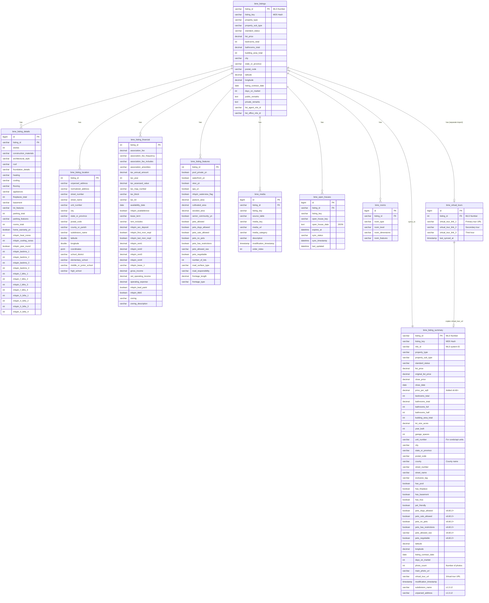

# Listing Data Structure Mapping

> **Version:** 1.3.12
> **Last Updated:** January 20, 2026
> **Last Verified Against Production:** January 20, 2026 (schema parity fix + ~3,963 misrouted listings cleanup)
> **iOS Implementation:** v301 - Unified Property Details Phase 1 in progress
> **Source Files:**
> - `class-mld-mobile-rest-api.php` (handle_get_property ~lines 3900-4430)
> - `Property.swift` (PropertyDetail struct, CodingKeys lines 1004-1229)
> - Database schema: `bme_*` tables (31 tables total)

This document provides comprehensive mapping of all listing fields by property type, showing which fields are universal, which are category-specific, and the iOS CodingKey mappings.

---

## Verification Summary (January 20, 2026)

This document was verified against the production database at bmnboston.com via SSH/WP-CLI.

### Verification Status

| Section | Status | Notes |
|---------|--------|-------|
| Table Existence | ✅ Verified | All 31 bme_* tables exist |
| property_type Values | ✅ Verified | All 7 values confirmed |
| property_sub_type Values | ✅ Verified | All 31 values documented (6 added in v1.3.0) |
| standard_status Values | ✅ Verified | Active: 3 values (Active, Pending, Active Under Contract), Archive: 4 values |
| Archive Table Schemas | ✅ Fixed | All active/archive table pairs now have IDENTICAL schemas (v1.3.12) |
| Floor Breakdown | ✅ Verified | Floors 1-4 + mlspin_flrs/levels columns |
| bme_listing_summary Columns | ✅ Verified | All 48 columns documented (2 added in v1.3.12) |
| bme_listing_location Columns | ✅ Verified | All 28 columns including school fields (v1.3.3) |
| bme_listing_features Columns | ✅ Verified | Pets, senior_community, road fields confirmed (v1.3.3) |
| bme_listing_financial Columns | ✅ Verified | Zoning fields confirmed (v1.3.3) |
| bme_media Columns | ✅ Verified | media_category (not media_type) |
| bme_open_houses Columns | ✅ Verified | All 9 columns documented |
| Supporting Tables | ✅ Verified | All 12 additional tables documented |
| iOS CodingKeys | ✅ Verified | Property.swift matches API field mappings |
| Virtual Tour Data Flow | ✅ Verified | bme_virtual_tours is authoritative source (v1.3.6) |
| Archival Process | ✅ Fixed | BME v4.0.31 fixes all archival bugs (v1.3.8) |
| Pet Columns in Summary | ✅ Fixed | BME v4.0.32 syncs pet detail columns (v1.3.9) |
| Summary Table Data | ✅ Cleaned | 2,830+ records (v1.3.9), 2,717 (v1.3.10), ~3,963 more (v1.3.12) |
| Virtual Tour Sync | ✅ Fixed | 2,535 active + 121 archive listings synced (v1.3.10) |
| School Data Documentation | ✅ Corrected | Clarified MLSPIN provides minimal school data (v1.3.10) |
| iOS Unified Property Details | 🔄 In Progress | Phase 1 - Smart defaults + Rental Details section (v1.3.11) |

### Key Changes in v1.3.12 (January 20, 2026)

1. **Fixed active/archive table schema parity (CRITICAL)**
   - Active and archive tables were designed to have identical schemas for easy data transfer
   - Schema drift had occurred over time, causing `INSERT INTO ... SELECT * FROM` to fail
   - Fixed by adding missing columns:
     - `wp_bme_listings_archive`: Added `last_imported_at`, `import_source` (was 72 cols, now 74)
     - `wp_bme_listing_summary`: Added `subdivision_name`, `unparsed_address` (was 46 cols, now 48)
   - All 6 table pairs now have **IDENTICAL** schemas: listings (74), details (100), location (28), financial (72), features (49), summary (48)
   - Data transfer between active/archive tables now works with `INSERT INTO ... SELECT * FROM`

2. **Cleaned up ~3,963 misrouted listings from archive to active**
   - Root cause: BME v4.0.31 fix was deployed Jan 17, 2026, but bug existed since Dec 18, 2025
   - Bug: `$archived_statuses` array incorrectly included "Pending" and "Active Under Contract"
   - Effect: Listings with these statuses were written to archive tables instead of active
   - Records fixed: 3,777 "Pending" + 187 "Active Under Contract" moved from archive to active
   - Also fixed: 116 duplicate summaries, 244 orphaned summaries

3. **Final database verification passed**
   - 0 duplicate listings between active/archive
   - 0 duplicate summaries between active/archive
   - 0 active statuses in archive tables
   - 0 orphaned summary records

### Key Changes in v1.3.11

1. **Added iOS Unified Property Details Implementation Status Section**
   - Documents smart defaults by property type (auto-expand relevant sections)
   - Documents Rental Details section fields and API mapping
   - **CRITICAL: Documents iOS/SwiftUI pitfalls that caused app crashes** (SF Symbols version, ViewBuilder complexity)
   - Tracks implementation progress and remaining work

2. **iOS v301 Changes**
   - Added `rentalExpanded`, `investmentExpanded` state variables
   - Implemented `applySmartDefaults()` for property-type-aware section expansion
   - Added `rentalDetailsSection()` for lease properties
   - Fixed crash caused by iOS 17-only SF Symbols (`dog.fill`, `cat.fill`) on iOS 16 target

### Key Changes in v1.3.10

1. **Fixed archive table containing non-archived status values**
   - Found 2,717 records with "Pending" (2,127) and "Active Under Contract" (590) in `bme_listing_summary_archive`
   - These were legacy records from before BME v4.0.31 archival fix that were never cleaned up
   - Fix: Moved all 2,717 records from archive to active summary table
   - Root cause: The BME code was fixed in v4.0.31, but existing misplaced records weren't migrated

2. **Synced virtual tour URLs to summary tables**
   - `bme_listing_summary.virtual_tour_url` was not being populated from `bme_virtual_tours`
   - Synced 2,535 active listings and 121 archive listings with virtual tour URLs
   - The BME Data Processor now correctly syncs this during listing updates (fixed in v4.0.30)

3. **Corrected school data claim** - Changed "~5,542 listings" to accurate count:
   - `elementary_school`, `middle_or_junior_school`, `high_school` are RARELY populated by MLSPIN (~50 total records)
   - `wp_mld_property_schools` mapping table exists but has 0 records (property-school linking not implemented)
   - School data should be retrieved via BMN Schools REST API, not from `bme_listing_location`

### Key Changes in v1.3.9

1. **Fixed pet detail columns not syncing to summary table (BME v4.0.32)**
   - `pets_dogs_allowed`, `pets_cats_allowed`, `pets_no_pets`, `pets_has_restrictions`, `pets_allowed_raw`, `pets_negotiable` were in the summary table schema but never populated
   - Root cause: `process_listing_summary()` only wrote `pet_friendly` (boolean), not the detail columns
   - Fix: Updated `process_listing_summary()` to call `parse_pets_allowed_details()` and populate all pet columns
   - One-time sync applied: 2,519 existing listings updated with pet data from `bme_listing_features`

2. **Cleaned up 2,830+ misplaced summary records**
   - 2,775 summary records were in active table but their listings were in archive → moved to archive summary
   - 55 duplicate "Active" records in archive summary deleted (listings exist in active)
   - 2 orphan records deleted (no listing in either table)
   - Active summary table now contains ONLY: Active, Active Under Contract, Pending

3. **Clarified school_district field** - The `school_district` column exists in `bme_listing_location` but is NEVER populated by MLSPIN. School data comes from the BMN Schools plugin via `wp_bmn_school_*` tables and the `wp_mld_property_schools` mapping table.

4. **Fixed archive table query example** - Section showing standard_status verification for archive table used incorrect column name `property_status`. The archive table uses `standard_status` (same as active table).

### Key Changes in v1.3.8

1. **ACTUALLY fixed BME Data Processor archival bugs (BME v4.0.31)** - The bugs documented in v1.3.5 were NOT actually fixed in the codebase. They have now been properly fixed:

   **Bug 1 - Wrong `$archived_statuses` array (line 53):**
   ```php
   // WAS STILL WRONG - included active statuses
   private $archived_statuses = ['Closed', 'Expired', 'Withdrawn', 'Pending', 'Canceled', 'Active Under Contract'];

   // NOW FIXED
   private $archived_statuses = ['Closed', 'Expired', 'Withdrawn', 'Canceled'];
   ```

   **Bug 2 - `process_listing_summary()` ignored `$table_suffix` (line 649):**
   ```php
   // WAS STILL WRONG - hardcoded to active table
   $summary_table = $wpdb->prefix . 'bme_listing_summary';

   // NOW FIXED - uses suffix for proper routing
   $summary_table = $wpdb->prefix . 'bme_listing_summary' . $table_suffix;
   ```

   **Bug 3 - Duplicate `is_listing_archived()` function (line 2186):**
   ```php
   // WAS STILL WRONG - had its own local array
   private function is_listing_archived($listing_data) {
       $archived_statuses = ['Closed', 'Expired', 'Withdrawn', 'Pending', 'Canceled', 'Active Under Contract'];
       ...
   }

   // NOW FIXED - uses class-level method
   private function is_listing_archived($listing_data) {
       $status = $listing_data['StandardStatus'] ?? '';
       return $this->is_archived_status($status);
   }
   ```

   **Bug 4 - `move_related_data()` didn't move summary table:**
   - Added new `move_summary_data()` function
   - Updated `move_related_data()` to accept MLS listing_id parameter and call `move_summary_data()`
   - Summary table now properly moves between active/archive tables

   **Files Modified:** `bridge-mls-extractor-pro-review/includes/class-bme-data-processor.php`

2. **Backfilled virtual tour URLs** - Ran UPDATE query to sync 2,502 virtual tour URLs from `bme_virtual_tours` to `bme_listing_summary` for active listings.

3. **Fixed orphan listing 73460741** - Listing had inconsistent data (summary in archive, details/location/financial/features in active). Fixed by:
   - Updated summary_archive status from "Active" to "Withdrawn"
   - Moved details, location, financial, features to archive tables

### Key Changes in v1.3.7

1. **Fixed virtual_tour_url sync bug in BME v4.0.30** - The bug identified in v1.3.6 has been fixed:

   **Root Cause:** `class-bme-data-processor.php:720` was looking for MLS fields (`VirtualTourURLUnbranded`/`VirtualTourURLBranded`) which MLSPIN doesn't provide, causing `virtual_tour_url` to be overwritten with empty string during listing updates.

   **Fix:** `process_listing_summary()` now queries `bme_virtual_tours` table directly (the authoritative source) instead of looking for non-existent MLS fields.

   **Files Modified:** `bridge-mls-extractor-pro-review/includes/class-bme-data-processor.php`

   **Result:** Summary table will now maintain correct `virtual_tour_url` values even when listings are updated. The 1,024 missing virtual tours will be restored as those listings are next updated by the MLS sync.

### Key Changes in v1.3.6

1. **Corrected virtual_tour_url source table documentation** - Previous versions incorrectly documented `virtual_tour_url` as coming from `bme_listing_summary`. The authoritative source is **`bme_virtual_tours`** table:

   **Data Flow:**
   - `bme_virtual_tours` table = PRIMARY source (separate import process, ~4,177 listings)
   - `bme_listing_summary.virtual_tour_url` = COPY (populated during stored procedure refresh)
   - API detail endpoint reads from `bme_virtual_tours` directly
   - MLSPIN does not provide virtual tour URLs through Bridge API

2. **Identified sync bug** - `class-bme-data-processor.php:720` had a bug where `process_listing_summary()` overwrote `virtual_tour_url` with empty string. **Fixed in v1.3.7 / BME v4.0.30.**

### Key Changes in v1.3.5

1. **Fixed summary table archival bug in BME Data Processor** - `class-bme-data-processor.php` had multiple bugs causing Closed listings to remain in the active `bme_listing_summary` table instead of being moved to `bme_listing_summary_archive`:

   **Bug 1 - Wrong archived_statuses array (line 54):**
   ```php
   // WRONG - included Pending and Active Under Contract
   private $archived_statuses = ['Closed', 'Expired', 'Withdrawn', 'Pending', 'Canceled', 'Active Under Contract'];

   // FIXED
   private $archived_statuses = ['Closed', 'Expired', 'Withdrawn', 'Canceled'];
   ```

   **Bug 2 - process_listing_summary ignored $table_suffix (line 655):**
   ```php
   // WRONG - hardcoded to active table
   $summary_table = $wpdb->prefix . 'bme_listing_summary';

   // FIXED - uses suffix for proper routing
   $summary_table = $wpdb->prefix . 'bme_listing_summary' . $table_suffix;
   ```

   **Bug 3 - move_related_data didn't handle summary table:**
   - Added new `move_summary_data()` function (lines 2512-2544)
   - Updated `move_related_data()` to call it with the MLS listing_id
   - Summary table uses MLS listing_id as key (not internal DB id like other related tables)

   **Bug 4 - Duplicate is_listing_archived function (line 2168):**
   - Had its own local `$archived_statuses` array that was out of sync
   - Changed to use class-level `$this->is_archived_status()` method

   **Root Cause:** Introduced in BME v4.0.14 when summary table writing was changed from stored procedure to inline PHP. The `$table_suffix` parameter was added but never used.

   **Symptoms:** Closed listings accumulated in active summary table, causing duplicates between active and archive tables.

   **Files Modified:** `bridge-mls-extractor-pro-review/includes/class-bme-data-processor.php`

### Key Changes in v1.3.4

1. **Removed non-existent fields** - The following fields were documented but do NOT exist in the MLSPIN/Bridge API data feed:
   - `association_name` - Not provided by MLSPIN
   - `association_phone` - Not provided by MLSPIN
   - `association_fee2` - Not provided by MLSPIN
   - `association_fee2_frequency` - Not provided by MLSPIN
   - `master_association_fee` - Not provided by MLSPIN
   - `condo_association_fee` - Not provided by MLSPIN
   - `pet_restrictions` (text field) - MLSPIN only provides `pets_allowed_raw` with values like "Yes w/ Restrictions", not actual restriction descriptions

2. **Corrected source table for `virtual_tour_url`** - Changed from `bme_listing_details` to `bme_listing_summary`

3. **Corrected column name** - `senior_community` → `senior_community_yn` (actual database column name)

4. **Added data population notes** - `school_district` column exists and is mapped but MLSPIN provides 0 data for this field; individual school fields (elementary, middle, high) ARE populated

5. **Updated field counts** - Section 6 now has ~8 fields (reduced from ~15 after removing non-existent fields)

### Key Changes in v1.3.3

1. **Corrected source table references** - Multiple fields were documented with incorrect source tables:
   - `pets_allowed`, `senior_community_yn` → moved from bme_listing_details to **bme_listing_features**
   - `zoning`, `zoning_description` → moved from bme_listing_details to **bme_listing_financial**
   - `school_district`, `elementary_school`, `middle_or_junior_school`, `high_school` → documented in **bme_listing_location**
   - `number_of_lots`, `road_surface_type`, `road_responsibility`, `frontage_type`, `frontage_length` → moved to **bme_listing_features**

2. **Expanded ER diagram for bme_listing_location** - Previous version showed only 6 fields, now shows 18 key fields including:
   - Full address components (street_number, street_name, unit_number, etc.)
   - School fields (school_district, elementary_school, middle_or_junior_school, high_school)
   - Coordinates (latitude, longitude, coordinates point)

3. **Expanded ER diagram for bme_listing_features** - Added 13 fields including pets_allowed, senior_community_yn, road fields

4. **Expanded ER diagram for bme_listing_financial** - Added zoning and tax fields

5. **Updated Appendix A** - Added bme_listing_location and bme_listing_features column listings, corrected bme_listing_details list

6. **Data cleanup** - Archived 2 listings with `standard_status='Closed'` that remained in active table

### Key Changes in v1.3.2

1. **Removed non-existent `lot_size_dimensions` column** - This column was documented but does not exist in the production `bme_listing_details` table. Removed from:
   - Section 3.7 (Lot fields table)
   - ER diagram (bme_listing_details schema)
   - iOS CodingKeys mapping table (PropertyDetail section)
   - Appendix A (bme_listing_details columns list)

2. **Removed non-existent property_sub_type values** - "Unimproved Land" and "Improved Land" were listed under Land category but do not exist in the production database

3. **Added missing property_sub_type value** - Added "3 Family - Rooming House" which exists in archive tables but was undocumented

4. **Updated NULL count** - Changed from 3,207 to 3,181 (counts change naturally as listings are updated)

### Key Changes in v1.3.1

1. **Re-verification via SSH/WP-CLI** - All sections independently verified against production database:
   - Column count correction: bme_listing_summary had 46 columns (not 47) - now 48 as of v1.3.12
   - **Data fix applied:** 994 listings with `standard_status='Closed'` were archived from `bme_listing_summary` to `bme_listing_summary_archive`
   - Active table now correctly contains only: Active, Pending, Active Under Contract

### Key Changes in v1.3.0

1. **property_sub_type values completed** - Added 6 previously undocumented values:
   - `Residential` (generic, 966 entries)
   - `Commercial` (generic, 112 entries)
   - `5+ Family - 5+ Units Up/Down` (62 entries)
   - `5+ Family - 5+ Units Side by Side` (19 entries)
   - `5+ Family - Rooming House` (15 entries)
   - `4 Family - Rooming House` (1 entry)

2. **bme_listing_summary columns added**:
   - `street_number VARCHAR(50)` - Street number
   - `street_name VARCHAR(100)` - Street name
   - `virtual_tour_url VARCHAR(500)` - Virtual tour URL

3. **bme_media column fix** - Changed `media_type` to `media_category` (actual DB column name)

4. **bme_open_houses columns expanded** - Added: `open_house_key`, `expires_at`, `sync_status`, `sync_timestamp`, `last_updated`

5. **Floor columns expanded** - Added documentation for `mlspin_flrs_1-4` and `mlspin_levels_1-4`

6. **12 supporting tables documented** - Added full schemas for:
   - bme_activity_logs, bme_api_requests, bme_error_log, bme_favorites
   - bme_market_stats, bme_performance_metrics, bme_property_history
   - bme_query_performance, bme_saved_searches, bme_system_alerts
   - bme_user_sessions, bme_virtual_tours

### Key Changes in v1.2.0

1. **property_sub_type values expanded** - Database contains 30+ granular values vs the 13 simplified values previously documented. Multi-family listings use detailed format like "2 Family - 2 Units Side by Side".

2. **Floor data supports 4 floors** - mlspin_bedrms_4, mlspin_f_bths_4, mlspin_h_bths_4 columns exist for 4-story properties.

3. **bme_listing_summary missing columns added**:
   - `mls_id` - MLS system identifier
   - `price_per_sqft` - Calculated price per square foot
   - `unit_number` - Unit number for condos/apartments
   - `county` - County name
   - `photo_count` - Number of photos
   - Pet filter columns (v6.60.2+): `pets_dogs_allowed`, `pets_cats_allowed`, `pets_no_pets`, `pets_has_restrictions`, `pets_allowed_raw`, `pets_negotiable`

---

## Table of Contents

1. [Property Type Hierarchy](#1-property-type-hierarchy)
2. [Quick Reference Matrix](#2-quick-reference-matrix)
   - 2.1 [List vs Detail Field Availability](#21-list-vs-detail-field-availability)
3. [Universal Fields (All Listings)](#3-universal-fields-all-listings)
4. [Lease-Only Fields](#4-lease-only-fields)
5. [Multi-Family / Investment Fields](#5-multi-family--investment-fields)
6. [Condo/HOA Fields](#6-condohoa-fields)
7. [Land-Specific Fields](#7-land-specific-fields)
8. [Commercial Fields](#8-commercial-fields)
9. [Massachusetts Disclosure Fields](#9-massachusetts-disclosure-fields)
10. [Agent-Only Fields](#10-agent-only-fields-v6603)
11. [Database ER Diagram](#11-database-er-diagram)
    - 11.1 [Archive Tables](#111-archive-tables)
    - 11.2 [Supporting Tables](#112-supporting-tables)
12. [iOS Field Name Mapping Table](#12-ios-field-name-mapping-table)
13. [Sample API Responses](#13-sample-api-responses)

---

## 1. Property Type Hierarchy

```mermaid
graph TD
    subgraph "Listing Categories"
        A[All Listings] --> B[Residential For Sale]
        A --> C[Residential Lease]
        A --> D[Residential Income]
        A --> E[Commercial Sale]
        A --> F[Commercial Lease]
        A --> G[Land]
        A --> H[Business Opportunity]
    end

    subgraph "Residential Sale Subtypes"
        B --> B1[Single Family Residence]
        B --> B2[Condominium]
        B --> B3[Townhouse]
        B --> B4[Stock Cooperative]
        B --> B5[Condex]
    end

    subgraph "Residential Lease Subtypes"
        C --> C1[Apartment]
        C --> C2[Condo Rental]
        C --> C3[House Rental]
    end

    subgraph "Multi-Family Subtypes"
        D --> D1[2-Family Variants]
        D --> D2[3-Family Variants]
        D --> D3[4-Family Variants]
        D --> D4[5+ Family]
        D --> D5[Duplex]
        D --> D6[Multi Family]
    end

    subgraph "Multi-Family Details Note"
        D1 -.-> D1a["Side by Side / Up Down / Rooming House"]
        D2 -.-> D2a["Side by Side / Up Down"]
        D3 -.-> D3a["Standard / Side by Side"]
    end

    subgraph "Special Field Sets"
        B2 -.- HOA[HOA Fields]
        B3 -.- HOA
        B4 -.- HOA
        C -.- LEASE[Lease Fields]
        F -.- LEASE
        D -.- INVEST[Investment Fields]
        G -.- LAND[Land Fields]
        E -.- COMM[Commercial Fields]
        F -.- COMM
    end

    style HOA fill:#e1f5fe
    style LEASE fill:#fff3e0
    style INVEST fill:#f3e5f5
    style LAND fill:#e8f5e9
    style COMM fill:#fce4ec
```



### Property Type → Field Set Reference

| Property Type | Special Field Sets |
|---------------|-------------------|
| Single Family Residence | Universal only |
| Condominium | Universal + HOA |
| Townhouse | Universal + HOA |
| Stock Cooperative | Universal + HOA |
| Residential Lease | Universal + Lease |
| Residential Income (Multi-Family) | Universal + Investment |
| Commercial Sale | Universal + Commercial |
| Commercial Lease | Universal + Commercial + Lease |
| Land | Universal + Land |
| Business Opportunity | Universal + Commercial |

---

## 2. Quick Reference Matrix

This matrix shows field availability across listing types.

| Field Category | All | Sale | Lease | Multi-Family | Condo/HOA | Land | Commercial |
|----------------|:---:|:----:|:-----:|:------------:|:---------:|:----:|:----------:|
| **Identification** |
| listing_id | ✓ | | | | | | |
| listing_key | ✓ | | | | | | |
| mls_number | ✓ | | | | | | |
| standard_status | ✓ | | | | | | |
| property_type | ✓ | | | | | | |
| property_sub_type | ✓ | | | | | | |
| **Price** |
| list_price | ✓ | | | | | | |
| original_list_price | ✓ | | | | | | |
| close_price | ✓ | | | | | | |
| price_per_sqft | ✓ | | | | | | |
| **Location** |
| address | ✓ | | | | | | |
| city | ✓ | | | | | | |
| state | ✓ | | | | | | |
| postal_code | ✓ | | | | | | |
| latitude/longitude | ✓ | | | | | | |
| neighborhood | ✓ | | | | | | |
| **Core Stats** |
| bedrooms_total | ✓ | | | | | | |
| bathrooms_total | ✓ | | | | | | |
| building_area_total | ✓ | | | | | | |
| lot_size_acres | ✓ | | | | | | |
| year_built | ✓ | | | | | | |
| stories | ✓ | | | | | | |
| **Media** |
| main_photo_url | ✓ | | | | | | |
| photos[] | ✓ | | | | | | |
| virtual_tour_url | ✓ | | | | | | |
| **Timing** |
| listing_contract_date | ✓ | | | | | | |
| days_on_market | ✓ | | | | | | |
| **Lease-Only** |
| availability_date | | | ✓ | | | | ✓ |
| lease_term | | | ✓ | | | | ✓ |
| rent_includes | | | ✓ | | | | ✓ |
| security_deposit | | | ✓ | | | | ✓ |
| first/last_month_required | | | ✓ | | | | ✓ |
| **Multi-Family** |
| unit_rents[] | | | | ✓ | | | |
| gross_income | | | | ✓ | | | |
| net_operating_income | | | | ✓ | | | |
| cap_rate | | | | ✓ | | | ✓ |
| **HOA** |
| association_fee | | | | | ✓ | | |
| association_fee_frequency | | | | | ✓ | | |
| association_fee_includes | | | | | ✓ | | |
| association_amenities | | | | | ✓ | | |
| pets_allowed | | | | | ✓ | | |
| **Land** |
| pasture_area | | | | | | ✓ | |
| cultivated_area | | | | | | ✓ | |
| wooded_area | | | | | | ✓ | |
| number_of_lots | | | | | | ✓ | |
| **Commercial** |
| business_type | | | | | | | ✓ |
| gross_scheduled_income | | | | | | | ✓ |
| tenant_pays | | | | | | | ✓ |
| **MA Disclosures** |
| lead_paint | ✓ | | | | | | |
| title_5_compliant | ✓ | | | | | | |
| short_sale | ✓ | | | | | | |

### 2.1 List vs Detail Field Availability

The API returns different field sets depending on the endpoint:

| Endpoint | Fields | Use Case |
|----------|--------|----------|
| `GET /properties` | ~50 fields | Search results, map view |
| `GET /property/{id}` | ~150 fields | Property detail page |

**List View Only Fields** (not in detail response):
- `next_open_house` - Formatted next open house string
- `is_shared_by_agent`, `shared_by_agent_name`, `shared_by_agent_photo` - Agent sharing context

**Detail View Only Fields** (not in list response):
- All interior/exterior feature details (heating, cooling, flooring, etc.)
- Tax information (annual amount, assessed value, lot/block/parcel)
- HOA details (amenities, fee includes, association info)
- School information (district, elementary, middle, high)
- Rooms array with per-room details
- Agent-only info section (for authenticated agents)
- Full rental/investment metrics (unit rents, NOI, cap rate)
- Construction details (materials, foundation, roof)
- Land specifics (pasture/cultivated/wooded area)
- `community_features` - Community amenities from features table
- `water_body_name` - Name of waterfront body
- `cable_available_yn` - Cable availability flag
- `internet_type` - Internet service types available

**iOS Model Mapping:**
- List view → `Property` struct (~50 fields)
- Detail view → `PropertyDetail` struct (~150 fields)

---

## 3. Universal Fields (All Listings)

These ~45 fields are present in every listing regardless of type.

### 3.1 Core Identification

| API Field | Type | Source Table | Description | Sample Value | Nullable | iOS CodingKey |
|-----------|------|--------------|-------------|--------------|----------|---------------|
| `id` | string | bme_listing_summary | Listing key (MD5 hash) | `"928c77fa6877d5c35c852989c83e5068"` | No | `id` |
| `mls_number` | string | bme_listing_summary | MLS listing ID | `"73464868"` | No | `mlsNumber = "mls_number"` |
| `is_exclusive` | boolean | computed | Is exclusive listing (listing_id < 1M) | `false` | No | `isExclusive = "is_exclusive"` |
| `exclusive_tag` | string | bme_listings | Badge text for exclusive | `"Coming Soon"` | Yes | `exclusiveTag = "exclusive_tag"` |

### 3.2 Address & Location

| API Field | Type | Source Table | Description | Sample Value | Nullable | iOS CodingKey |
|-----------|------|--------------|-------------|--------------|----------|---------------|
| `address` | string | computed | Full street address | `"123 Main Street"` | No | `address` |
| `city` | string | bme_listing_summary | City name | `"Boston"` | No | `city` |
| `state` | string | bme_listing_summary | State abbreviation | `"MA"` | No | `state` |
| `zip` | string | bme_listing_summary | Postal code | `"02116"` | No | `zip` |
| `neighborhood` | string | bme_listing_location | Subdivision name | `"Back Bay"` | Yes | `neighborhood` |
| `latitude` | float | bme_listing_summary | GPS latitude | `42.351524` | No | `latitude` |
| `longitude` | float | bme_listing_summary | GPS longitude | `-71.076178` | No | `longitude` |

### 3.3 Price & Status

| API Field | Type | Source Table | Description | Sample Value | Nullable | iOS CodingKey |
|-----------|------|--------------|-------------|--------------|----------|---------------|
| `price` | int | bme_listing_summary | Current list price | `1250000` | No | `price` |
| `original_price` | int | bme_listing_summary | Original list price (if reduced) | `1350000` | Yes | `originalPrice = "original_price"` |
| `close_price` | int | bme_listing_summary | Final sale price | `1225000` | Yes | `closePrice = "close_price"` |
| `close_date` | string | bme_listing_summary | Sale date | `"2025-01-15"` | Yes | `closeDate = "close_date"` |
| `price_per_sqft` | int | computed | Price per square foot | `625` | Yes | `pricePerSqft = "price_per_sqft"` |
| `status` | string | bme_listing_summary | Standard status | `"Active"` | No | `standardStatus = "status"` |

### 3.4 Sold Statistics

| API Field | Type | Source Table | Description | Sample Value | Nullable | iOS CodingKey |
|-----------|------|--------------|-------------|--------------|----------|---------------|
| `list_to_sale_ratio` | float | computed | Sale/List price % | `98.0` | Yes | `listToSaleRatio = "list_to_sale_ratio"` |
| `sold_above_below` | string | computed | "above", "below", or "at" | `"below"` | Yes | `soldAboveBelow = "sold_above_below"` |
| `price_difference` | int | computed | Sale - List price | `-25000` | Yes | `priceDifference = "price_difference"` |

### 3.5 Property Type

| API Field | Type | Source Table | Description | Sample Value | Nullable | iOS CodingKey |
|-----------|------|--------------|-------------|--------------|----------|---------------|
| `property_type` | string | bme_listing_summary | Main category | `"Residential"` | No | `propertyType = "property_type"` |
| `property_subtype` | string | bme_listing_summary | Sub-category | `"Single Family Residence"` | Yes | `propertySubtype = "property_subtype"` |

**Valid property_type values:**
- `Residential` - For Sale residential
- `Residential Lease` - For Rent
- `Residential Income` - Multi-family investment
- `Commercial Sale`
- `Commercial Lease`
- `Land`
- `Business Opportunity`

**Valid property_sub_type values (from actual database, verified 2026-01-18):**

**Residential (For Sale):**
- `Single Family Residence` - Standard single-family home (6,030 entries)
- `Condominium` - Condo unit (4,480 entries)
- `Residential` - Generic residential sub-type (966 entries)
- `Attached (Townhouse/Rowhouse/Duplex)` - Attached dwelling (581 entries)
- `Condex` - Condex (condo exception) (42 entries)
- `Stock Cooperative` - Stock co-op (14 entries)
- `Duplex` - Generic duplex (11 entries)
- `Mobile Home` - Mobile/manufactured home (212 entries)

**Residential Lease:**
- `Apartment` - Rental apartment (3,754 entries)
- `Condominium` - Condo rental
- `Single Family Residence` - House rental

**Residential Income (Multi-Family):**
- `Multi Family` - Generic multi-family (337 entries)
- `3 Family` - Triple-decker (generic) (221 entries)
- `2 Family - 2 Units Up/Down` - Up/down duplex (211 entries)
- `5-9 Family` - 5-9 unit buildings (108 entries)
- `3 Family - 3 Units Up/Down` - Up/down triple (77 entries)
- `3 Family - Rooming House` - 3-family rooming house (archive only)
- `2 Family - 2 Units Side by Side` - Side-by-side duplex (73 entries)
- `5+ Family - 5+ Units Up/Down` - 5+ unit up/down style (62 entries)
- `4 Family` - Four-family (generic) (46 entries)
- `4 Family - 4 Units Up/Down` - Up/down four-family (23 entries)
- `5+ Family - 5+ Units Side by Side` - 5+ unit side-by-side (19 entries)
- `5+ Family - Rooming House` - 5+ unit rooming house (15 entries)
- `3 Family - 3 Units Side by Side` - Side-by-side triple (9 entries)
- `4 Family - 4 Units Side by Side` - Side-by-side four-family (3 entries)
- `2 Family - Rooming House` - 2-family rooming house (1 entry)
- `4 Family - Rooming House` - 4-family rooming house (1 entry)

**Land:**
- `Agriculture` - Agricultural use (24 entries)
- `Non-Buildable` - Non-buildable land (22 entries)
- `Farm` - Agricultural land (14 entries)
- `Equestrian` - Horse property (11 entries)

**Commercial:**
- `Commercial` - Generic commercial property (112 entries)
- Various specific commercial sub-types

**Other:**
- `Parking` - Parking space (65 entries)
- `NULL` - Many listings have NULL sub-type (3,181 entries)

> **Important:** The database contains 31 distinct property_sub_type values. When filtering, use exact matches. Some iOS filters map simplified values (e.g., "Townhouse") to the full MLS values (e.g., "Attached (Townhouse/Rowhouse/Duplex)").

### 3.6 Core Stats

| API Field | Type | Source Table | Description | Sample Value | Nullable | iOS CodingKey |
|-----------|------|--------------|-------------|--------------|----------|---------------|
| `beds` | int | bme_listing_summary | Bedrooms | `4` | No | `beds` |
| `baths` | float | bme_listing_summary | Total bathrooms | `2.5` | No | `baths` |
| `baths_full` | int | bme_listing_details | Full bathrooms | `2` | Yes | `bathsFull = "baths_full"` |
| `baths_half` | int | bme_listing_details | Half bathrooms | `1` | Yes | `bathsHalf = "baths_half"` |
| `sqft` | int | bme_listing_summary | Building area total | `2450` | Yes | `sqft` |
| `year_built` | int | bme_listing_summary | Construction year | `1925` | Yes | `yearBuilt = "year_built"` |

### 3.7 Lot

| API Field | Type | Source Table | Description | Sample Value | Nullable | iOS CodingKey |
|-----------|------|--------------|-------------|--------------|----------|---------------|
| `lot_size` | int | computed | Lot size in sq ft | `10890` | Yes | `lotSize = "lot_size"` |
| `lot_size_acres` | float | bme_listing_summary | Lot size in acres | `0.25` | Yes | `lotSizeAcres = "lot_size_acres"` |
| `lot_features` | string | bme_listing_details | Lot features array | `"Level,Landscaped"` | Yes | `lotFeatures = "lot_features"` |

### 3.8 Parking & Garage

| API Field | Type | Source Table | Description | Sample Value | Nullable | iOS CodingKey |
|-----------|------|--------------|-------------|--------------|----------|---------------|
| `garage_spaces` | int | bme_listing_summary | Garage spaces | `2` | Yes | `garageSpaces = "garage_spaces"` |
| `parking_total` | int | bme_listing_details | Total parking | `4` | Yes | `parkingTotal = "parking_total"` |
| `parking_features` | string | bme_listing_details | Parking features | `"Attached,Paved Driveway"` | Yes | `parkingFeatures = "parking_features"` |
| `covered_spaces` | int | bme_listing_details | Covered spaces | `2` | Yes | `coveredSpaces = "covered_spaces"` |
| `open_parking_spaces` | int | bme_listing_details | Open parking | `2` | Yes | `openParkingSpaces = "open_parking_spaces"` |

### 3.9 Timing

| API Field | Type | Source Table | Description | Sample Value | Nullable | iOS CodingKey |
|-----------|------|--------------|-------------|--------------|----------|---------------|
| `list_date` | string | bme_listing_summary | Listing contract date | `"2025-01-01"` | Yes | `listDate = "list_date"` |
| `dom` | int | bme_listing_summary | Days on market | `14` | No | `dom` |

### 3.10 Media

| API Field | Type | Source Table | Description | Sample Value | Nullable | iOS CodingKey |
|-----------|------|--------------|-------------|--------------|----------|---------------|
| `photos` | array | bme_media | Photo URLs | `["https://...", ...]` | No | `photos` |
| `photo_count` | int | computed | Number of photos | `25` | No | `photoCount = "photo_count"` |
| `virtual_tour_url` | string | **bme_virtual_tours** | Primary virtual tour URL | `"https://..."` | Yes | `virtualTourUrl = "virtual_tour_url"` |
| `virtual_tours` | array | **bme_virtual_tours** | All tour URLs (up to 3) | `["url1", "url2"]` | Yes | `virtualTours = "virtual_tours"` |

> **Virtual Tour Data Architecture (Important):**
>
> Virtual tours are managed through a **separate import process** independent of the main MLS data sync.
> The authoritative source is the `bme_virtual_tours` table, which stores up to 3 tour URLs per listing:
> - `virtual_tour_link_1` (primary)
> - `virtual_tour_link_2` (secondary)
> - `virtual_tour_link_3` (tertiary)
>
> **Data flow:**
> 1. Virtual tours are imported into `bme_virtual_tours` (separate process, ~4,177 listings)
> 2. `bme_listing_summary.virtual_tour_url` is populated via subquery during full summary refresh
> 3. API property detail endpoint reads directly from `bme_virtual_tours` (all 3 URLs)
> 4. API list endpoint JOINs to `bme_virtual_tours` when `has_virtual_tour` filter is used
>
> **Fixed (BME v4.0.30):** The incremental summary update in `class-bme-data-processor.php`
> now correctly queries `bme_virtual_tours` table instead of looking for non-existent MLS fields.
> Virtual tours in the summary table will be preserved during listing updates.
>
> **Note:** `bme_listings.virtual_tour_url_unbranded` and `virtual_tour_url_branded` columns
> exist for MLS data, but MLSPIN does not provide virtual tour URLs through the Bridge API.

### 3.11 Open Houses

| API Field | Type | Source Table | Description | Sample Value | Nullable | iOS CodingKey |
|-----------|------|--------------|-------------|--------------|----------|---------------|
| `has_open_house` | boolean | computed | Has scheduled open house | `true` | No | `hasOpenHouse = "has_open_house"` |
| `open_houses` | array | bme_open_houses | Open house schedule | `[{start_time, end_time, remarks}]` | No | `openHouses = "open_houses"` |

### 3.12 Description

| API Field | Type | Source Table | Description | Sample Value | Nullable | iOS CodingKey |
|-----------|------|--------------|-------------|--------------|----------|---------------|
| `description` | string | bme_listings | Public remarks | `"Beautiful home..."` | Yes | `description` |

### 3.13 HVAC & Floor Breakdown (v6.66.0)

| API Field | Type | Source Table | Description | Sample Value | Nullable | iOS CodingKey |
|-----------|------|--------------|-------------|--------------|----------|---------------|
| `home_warranty` | boolean | bme_listing_details | Home warranty included | `true` | Yes | `homeWarranty = "home_warranty"` |
| `heat_zones` | int | bme_listing_details | Number of heating zones | `2` | Yes | `heatZones = "heat_zones"` |
| `cool_zones` | int | bme_listing_details | Number of cooling zones | `1` | Yes | `coolZones = "cool_zones"` |
| `year_round` | boolean | bme_listing_details | Year-round accessible | `true` | Yes | `yearRound = "year_round"` |
| `beds_by_floor` | object | computed | Bedrooms per floor | `{"1": 2, "2": 2, "3": 1}` | Yes | `bedsByFloor = "beds_by_floor"` |
| `baths_by_floor` | object | computed | Full baths per floor | `{"1": 1, "2": 1, "3": 0}` | Yes | `bathsByFloor = "baths_by_floor"` |
| `showing_deferral_date` | string | bme_listings | Showing deferral date | `"2025-02-01"` | Yes | `showingDeferralDate = "showing_deferral_date"` |

**beds_by_floor / baths_by_floor mapping:**
- Floor 1 → `mlspin_bedrms_1` / `mlspin_f_bths_1` / `mlspin_h_bths_1`
- Floor 2 → `mlspin_bedrms_2` / `mlspin_f_bths_2` / `mlspin_h_bths_2`
- Floor 3 → `mlspin_bedrms_3` / `mlspin_f_bths_3` / `mlspin_h_bths_3`
- Floor 4 → `mlspin_bedrms_4` / `mlspin_f_bths_4` / `mlspin_h_bths_4`

**Additional floor-related columns in bme_listing_details:**
- `mlspin_flrs_1` through `mlspin_flrs_4` - Floor descriptions/features
- `mlspin_levels_1` through `mlspin_levels_4` - Level/story information

> **Note (verified 2026-01-18):** Database supports floors 1-4 with bedroom, bath (full/half), floor description, and level columns for each floor.

---

## 4. Lease-Only Fields

These ~12 fields are unique to rental listings (`Residential Lease` and `Commercial Lease`).

### 4.1 Availability

| API Field | Type | Source Table | Description | Sample Value | Nullable | iOS CodingKey |
|-----------|------|--------------|-------------|--------------|----------|---------------|
| `availability_date` | string | bme_listing_financial | Move-in date | `"2025-02-01"` | Yes | `availabilityDate = "availability_date"` |
| `available_now` | boolean | bme_listing_financial | Immediately available | `true` | No | `availableNow = "available_now"` |
| `lease_term` | string | bme_listing_financial | Lease duration | `"12 months"` | Yes | `leaseTerm = "lease_term"` |

### 4.2 Rent Details

| API Field | Type | Source Table | Description | Sample Value | Nullable | iOS CodingKey |
|-----------|------|--------------|-------------|--------------|----------|---------------|
| `rent_includes` | string | bme_listing_financial | Utilities included | `"Heat,Hot Water,Electric"` | Yes | `rentIncludes = "rent_includes"` |
| `security_deposit` | float | bme_listing_financial | Security deposit amount | `2500.00` | Yes | `securityDeposit = "security_deposit"` |

### 4.3 Move-in Requirements

| API Field | Type | Source Table | Description | Sample Value | Nullable | iOS CodingKey |
|-----------|------|--------------|-------------|--------------|----------|---------------|
| `first_month_required` | boolean | bme_listing_financial | First month at signing | `true` | No | `firstMonthRequired = "first_month_required"` |
| `last_month_required` | boolean | bme_listing_financial | Last month at signing | `true` | No | `lastMonthRequired = "last_month_required"` |
| `references_required` | boolean | bme_listing_financial | References required | `true` | No | `referencesRequired = "references_required"` |
| `deposit_required` | boolean | bme_listing_financial | Deposit required | `true` | No | `depositRequired = "deposit_required"` |
| `insurance_required` | boolean | bme_listing_financial | Renters insurance required | `false` | No | `insuranceRequired = "insurance_required"` |

---

## 5. Multi-Family / Investment Fields

These ~10 fields are for income properties (`Residential Income`).

### 5.1 Unit Rent Breakdown

| API Field | Type | Source Table | Description | Sample Value | Nullable | iOS CodingKey |
|-----------|------|--------------|-------------|--------------|----------|---------------|
| `unit_rents` | array | computed | Per-unit rent info (built from rent1-4 + lease_1-4) | See below | Yes | `unitRents = "unit_rents"` |
| `total_monthly_rent` | float | computed | Sum of all unit rents | `7500.00` | Yes | `totalMonthlyRent = "total_monthly_rent"` |

**unit_rents array structure (computed in PHP):**
```json
[
  {"unit": 1, "rent": 2500.00, "lease": "12/2025"},
  {"unit": 2, "rent": 2500.00, "lease": "03/2026"},
  {"unit": 3, "rent": 2500.00, "lease": "Month-to-month"}
]
```

Source fields in `bme_listing_financial`:
- `mlspin_rent1`, `mlspin_rent2`, `mlspin_rent3`, `mlspin_rent4`
- `mlspin_lease_1`, `mlspin_lease_2`, `mlspin_lease_3`, `mlspin_lease_4`

### 5.2 Investment Metrics

| API Field | Type | Source Table | Description | Sample Value | Nullable | iOS CodingKey |
|-----------|------|--------------|-------------|--------------|----------|---------------|
| `gross_income` | float | bme_listing_financial | Annual gross income | `90000.00` | Yes | `grossIncome = "gross_income"` |
| `net_operating_income` | float | bme_listing_financial | Annual NOI | `72000.00` | Yes | `netOperatingIncome = "net_operating_income"` |
| `operating_expense` | float | bme_listing_financial | Annual expenses | `18000.00` | Yes | `operatingExpense = "operating_expense"` |
| `total_actual_rent` | float | bme_listing_financial | Total actual annual rent | `90000.00` | Yes | `totalActualRent = "total_actual_rent"` |
| `cap_rate` | float | computed | Capitalization rate | `6.5` | Yes | `capRate = "cap_rate"` |

**Cap Rate Calculation:**
```php
$cap_rate = ($net_operating_income > 0 && $price > 0)
    ? round(($net_operating_income / $price) * 100, 2)
    : null;
```

---

## 6. Condo/HOA Fields

These ~8 fields apply to association properties (`Condominium`, `Townhouse`, `Stock Cooperative`).

> **Note (v1.3.4):** Fields like `association_name`, `association_phone`, `association_fee2`, `master_association_fee`, and `condo_association_fee` are part of the RESO standard but are NOT provided by MLSPIN/Bridge API. Only the fields listed below are available.

### 6.1 Association Fees

| API Field | Type | Source Table | Description | Sample Value | Nullable | iOS CodingKey |
|-----------|------|--------------|-------------|--------------|----------|---------------|
| `hoa_fee` | float | bme_listing_financial | Primary HOA fee | `450.00` | Yes | `hoaFee = "hoa_fee"` |
| `hoa_fee_frequency` | string | bme_listing_financial | Fee frequency | `"Monthly"` | Yes | `hoaFeeFrequency = "hoa_fee_frequency"` |

### 6.2 Fee Breakdown

| API Field | Type | Source Table | Description | Sample Value | Nullable | iOS CodingKey |
|-----------|------|--------------|-------------|--------------|----------|---------------|
| `association_fee_includes` | string | bme_listing_financial | What fee covers | `"Water,Sewer,Insurance,Maintenance"` | Yes | `associationFeeIncludes = "association_fee_includes"` |
| `optional_fee` | float | bme_listing_financial | Optional fee amount (mlspin_optional_fee) | `50.00` | Yes | `optionalFee = "optional_fee"` |
| `optional_fee_includes` | string | bme_listing_financial | Optional fee items (mlspin_opt_fee_includes) | `"Parking,Storage"` | Yes | `optionalFeeIncludes = "optional_fee_includes"` |

### 6.3 Association Details

| API Field | Type | Source Table | Description | Sample Value | Nullable | iOS CodingKey |
|-----------|------|--------------|-------------|--------------|----------|---------------|
| `association_yn` | boolean | bme_listing_financial | Has HOA | `true` | No | `associationYn = "association_yn"` |
| `association_amenities` | string | bme_listing_financial | Building amenities | `"Pool,Gym,Concierge"` | Yes | `associationAmenities = "association_amenities"` |
| `owner_occupied_units` | int | bme_listing_financial | Owner-occupied count (mlspin_no_units_owner_occ) | `45` | Yes | `ownerOccupiedUnits = "owner_occupied_units"` |

### 6.4 Pet Policy

| API Field | Type | Source Table | Description | Sample Value | Nullable | iOS CodingKey |
|-----------|------|--------------|-------------|--------------|----------|---------------|
| `pets_allowed` | boolean | bme_listing_features | Pet policy flag | `true` | Yes | `petsAllowed = "pets_allowed"` |
| `pets_allowed_raw` | string | bme_listing_features | Pet policy text | `"Yes w/ Restrictions"` | Yes | - |
| `senior_community_yn` | boolean | bme_listing_features | 55+ community | `false` | No | `seniorCommunity = "senior_community"` |

> **Note (v1.3.4):** MLSPIN does not provide detailed pet restriction text. The `pets_allowed_raw` field contains values like "Yes", "No", "Yes w/ Restrictions", or "Unknown" - not actual restriction descriptions.

---

## 7. Land-Specific Fields

These ~12 fields apply to land listings.

### 7.1 Land Area Breakdown

| API Field | Type | Source Table | Description | Sample Value | Nullable | iOS CodingKey |
|-----------|------|--------------|-------------|--------------|----------|---------------|
| `pasture_area` | float | bme_listing_features | Pasture acres | `15.5` | Yes | `pastureArea = "pasture_area"` |
| `cultivated_area` | float | bme_listing_features | Cultivated acres | `8.0` | Yes | `cultivatedArea = "cultivated_area"` |
| `wooded_area` | float | bme_listing_features | Wooded acres | `6.5` | Yes | `woodedArea = "wooded_area"` |

### 7.2 Lot Configuration

| API Field | Type | Source Table | Description | Sample Value | Nullable | iOS CodingKey |
|-----------|------|--------------|-------------|--------------|----------|---------------|
| `number_of_lots` | int | bme_listing_features | Total lots | `3` | Yes | `numberOfLots = "number_of_lots"` |
| `road_surface_type` | string | bme_listing_features | Road surface | `"Paved,Gravel"` | Yes | `roadSurfaceType = "road_surface_type"` |
| `road_responsibility` | string | bme_listing_features | Road maintenance | `"Public"` | Yes | `roadResponsibility = "road_responsibility"` |

### 7.3 Terrain

| API Field | Type | Source Table | Description | Sample Value | Nullable | iOS CodingKey |
|-----------|------|--------------|-------------|--------------|----------|---------------|
| `vegetation` | string | bme_listing_details | Vegetation types | `"Hardwoods,Brush"` | Yes | `vegetation` |
| `topography` | string | bme_listing_details | Terrain | `"Level,Rolling"` | Yes | `topography` |
| `frontage_type` | string | bme_listing_features | Frontage type | `"Road,Waterfront"` | Yes | `frontageType = "frontage_type"` |
| `frontage_length` | int | bme_listing_features | Frontage feet | `200` | Yes | `frontageLength = "frontage_length"` |

---

## 8. Commercial Fields

These ~6 fields apply to commercial properties.

| API Field | Type | Source Table | Description | Sample Value | Nullable | iOS CodingKey |
|-----------|------|--------------|-------------|--------------|----------|---------------|
| `business_type` | string | bme_listings | Business category | `"Retail"` | Yes | `businessType = "business_type"` |
| `development_status` | string | bme_listings | Development status | `"Existing"` | Yes | `developmentStatus = "development_status"` |
| `gross_scheduled_income` | float | bme_listing_financial | Gross scheduled income | `150000.00` | Yes | `grossScheduledIncome = "gross_scheduled_income"` |
| `existing_lease_type` | string | bme_listing_financial | Current lease type | `"Triple Net"` | Yes | `existingLeaseType = "existing_lease_type"` |
| `tenant_pays` | string | bme_listing_financial | Tenant responsibilities | `"Electric,Gas,Water"` | Yes | `tenantPays = "tenant_pays"` |
| `concessions_amount` | float | bme_listing_financial | Concessions offered | `5000.00` | Yes | `concessionsAmount = "concessions_amount"` |

---

## 9. Massachusetts Disclosure Fields

These ~6 fields are MA-specific disclosures.

| API Field | Type | Source Table | Description | Sample Value | Nullable | iOS CodingKey |
|-----------|------|--------------|-------------|--------------|----------|---------------|
| `lead_paint` | boolean | bme_listing_financial | Lead paint present | `true` | No | `leadPaint = "lead_paint"` |
| `title_5_compliant` | boolean | bme_listing_financial | Septic compliant | `true` | No | `title5Compliant = "title_5_compliant"` |
| `perc_test_done` | boolean | bme_listing_financial | Perc test completed | `true` | No | `percTestDone = "perc_test_done"` |
| `perc_test_date` | string | bme_listing_financial | Perc test date | `"2024-06-15"` | Yes | `percTestDate = "perc_test_date"` |
| `short_sale` | boolean | bme_listings | Short sale listing | `false` | No | `shortSale = "short_sale"` |
| `lender_owned` | boolean | bme_listing_financial | REO/Bank owned | `false` | No | `lenderOwned = "lender_owned"` |

---

## 10. Agent-Only Fields (v6.60.3)

These fields are **only returned for authenticated agent users** viewing properties. Regular users do not receive this data.

| API Field | Type | Source Table | Description | Sample Value | Nullable | iOS CodingKey |
|-----------|------|--------------|-------------|--------------|----------|---------------|
| `agent_only_info` | object | - | Wrapper for agent-only data | `{...}` | Yes | `agentOnlyInfo = "agent_only_info"` |
| `agent_only_info.private_remarks` | string | bme_listings | Agent-only notes | `"Motivated seller..."` | Yes | - |
| `agent_only_info.private_office_remarks` | string | bme_listings | Office-only notes | `"Prefer afternoon..."` | Yes | - |
| `agent_only_info.showing_instructions` | string | bme_listings | Showing instructions | `"Call before..."` | Yes | - |

**Access Control:**
- Requires JWT authentication with agent role
- Not returned for regular client users
- Used by agents to view confidential listing notes

---

## 11. Database ER Diagram



> **Note:** This ER diagram shows key columns only. The actual tables contain many additional MLSPIN-specific columns (e.g., `mlspin_bedrms_1-4`, `mlspin_f_bths_1-4`, `mlspin_market_time_*`, etc.). For complete column listings, see the database manager source code in `bridge-mls-extractor-pro/includes/class-bme-database-manager.php`.

### Table Summary

| Table | Purpose | Key Fields |
|-------|---------|------------|
| `bme_listings` | Core listing data | 40+ fields from MLS |
| `bme_listing_details` | Extended property details | 80+ detailed fields |
| `bme_listing_location` | Address/location details | subdivision, directions |
| `bme_listing_financial` | HOA, taxes, rental data | fees, taxes, unit rents |
| `bme_listing_features` | Boolean feature flags | pool, waterfront, view |
| `bme_listing_summary` | Denormalized cache | Fast list queries |
| `bme_media` | Photo/media URLs | Ordered media list |
| `bme_open_houses` | Open house schedule | JSON event data |
| `bme_rooms` | Room details | Per-room info |

### 11.1 Archive Tables

The system maintains parallel archive tables for closed/off-market listings to optimize query performance:

| Active Table | Archive Table |
|--------------|---------------|
| `bme_listings` | `bme_listings_archive` |
| `bme_listing_details` | `bme_listing_details_archive` |
| `bme_listing_location` | `bme_listing_location_archive` |
| `bme_listing_financial` | `bme_listing_financial_archive` |
| `bme_listing_features` | `bme_listing_features_archive` |
| `bme_listing_summary` | `bme_listing_summary_archive` |

**Purpose:** Separating active from archived data improves query performance for property search (most users search active listings).

**Archive Trigger:** Listings are moved to archive tables when `standard_status` changes to `Closed`, `Withdrawn`, `Expired`, or `Canceled`.

**Schema Parity (v1.3.12):** All active/archive table pairs now have **IDENTICAL** schemas, enabling direct data transfer with `INSERT INTO ... SELECT * FROM`:

| Table Pair | Columns |
|------------|---------|
| `bme_listings` / `_archive` | 74 |
| `bme_listing_details` / `_archive` | 100 |
| `bme_listing_location` / `_archive` | 28 |
| `bme_listing_financial` / `_archive` | 72 |
| `bme_listing_features` / `_archive` | 49 |
| `bme_listing_summary` / `_archive` | 48 |

This enables simple data transfer between tables:
```sql
-- Move listing from active to archive
INSERT INTO wp_bme_listings_archive SELECT * FROM wp_bme_listings WHERE listing_id = 12345;
DELETE FROM wp_bme_listings WHERE listing_id = 12345;
```

### 11.2 Supporting Tables

Additional tables that support the listing system:

| Table | Purpose | Key Fields |
|-------|---------|------------|
| `bme_agents` | Agent MLS data | agent_mls_id, name, email, phone, office_mls_id |
| `bme_offices` | Office MLS data | office_mls_id, name, phone, address |
| `bme_extraction_logs` | MLS sync logs | extraction_id, status, listings_processed, duration |
| `bme_search_cache` | Search result caching | cache_key, search_params, result_listing_ids, expires_at |

### 11.3 Operational & Analytics Tables

These 12 tables provide system monitoring, user activity tracking, and analytics capabilities:

#### bme_activity_logs
**Purpose:** Tracks all system activities, user actions, and MLS data changes for auditing.

| Column | Type | Description |
|--------|------|-------------|
| id | bigint unsigned | Primary key |
| activity_type | varchar(50) | Type of activity (extraction, user, system) |
| action | varchar(50) | Specific action taken |
| entity_type | varchar(50) | Type of entity affected |
| entity_id | varchar(255) | ID of affected entity |
| mls_id | varchar(50) | MLS system identifier |
| listing_key | varchar(255) | Listing key if applicable |
| extraction_id | bigint unsigned | Related extraction log |
| title | varchar(500) | Activity title/summary |
| description | text | Detailed description |
| details | longtext | JSON detailed data |
| old_values | longtext | Previous values (JSON) |
| new_values | longtext | New values (JSON) |
| severity | varchar(20) | Severity level (info/warning/error) |
| user_id | bigint unsigned | User who triggered activity |
| session_id | varchar(100) | Session identifier |
| ip_address | varchar(45) | IP address |
| related_ids | text | Related entity IDs |
| created_at | timestamp | When logged |

#### bme_api_requests
**Purpose:** Logs all Bridge MLS API requests for debugging and performance analysis.

| Column | Type | Description |
|--------|------|-------------|
| id | bigint unsigned | Primary key |
| extraction_id | bigint unsigned | Related extraction log |
| endpoint | varchar(500) | API endpoint called |
| method | varchar(10) | HTTP method (GET/POST) |
| request_params | longtext | Request parameters (JSON) |
| response_code | int | HTTP response code |
| response_time | decimal(8,3) | Response time in seconds |
| response_size | int | Response size in bytes |
| listings_count | int | Number of listings returned |
| error_message | text | Error message if failed |
| user_agent | varchar(500) | User agent string |
| ip_address | varchar(45) | Request IP |
| created_at | timestamp | When request made |

#### bme_error_log
**Purpose:** Centralized error logging for all MLS extraction errors.

| Column | Type | Description |
|--------|------|-------------|
| id | int | Primary key |
| timestamp | datetime | When error occurred |
| extraction_id | int | Related extraction |
| error_code | varchar(20) | Error code identifier |
| category | varchar(50) | Error category |
| severity | varchar(20) | Severity level |
| message | text | Error message |
| context | text | Error context (JSON) |
| exception_message | text | Full exception message |
| recovery_strategy | varchar(20) | How error was handled |
| created_at | timestamp | Record creation time |

#### bme_favorites
**Purpose:** Stores user favorite/saved listings.

| Column | Type | Description |
|--------|------|-------------|
| id | bigint unsigned | Primary key |
| user_id | bigint unsigned | WordPress user ID |
| listing_id | int unsigned | MLS listing number |
| notes | text | User notes on listing |
| created_at | timestamp | When favorited |

#### bme_market_stats
**Purpose:** Aggregated market statistics by city, property type, and date.

| Column | Type | Description |
|--------|------|-------------|
| stat_date | date | Statistics date (PK) |
| city | varchar(100) | City name (PK) |
| property_type | varchar(50) | Property type (PK) |
| total_active_listings | int | Total active count |
| new_listings_count | int | New listings this period |
| pending_listings_count | int | Pending count |
| closed_listings_count | int | Closed count |
| avg_list_price | decimal(20,2) | Average list price |
| median_list_price | decimal(20,2) | Median list price |
| avg_close_price | decimal(20,2) | Average sale price |
| median_close_price | decimal(20,2) | Median sale price |
| avg_price_per_sqft | decimal(10,2) | Average $/sqft |
| avg_days_on_market | int | Average DOM |
| median_days_on_market | int | Median DOM |
| months_of_inventory | decimal(4,2) | Months of inventory |
| price_change_pct | decimal(5,2) | Price change % |
| created_at | timestamp | Record creation |

#### bme_performance_metrics
**Purpose:** Tracks system performance metrics for monitoring.

| Column | Type | Description |
|--------|------|-------------|
| id | bigint unsigned | Primary key |
| metric_type | varchar(100) | Type of metric |
| metric_name | varchar(255) | Metric name |
| metric_value | decimal(15,4) | Metric value |
| metric_unit | varchar(50) | Unit of measurement |
| extraction_id | bigint unsigned | Related extraction |
| user_id | bigint unsigned | User if applicable |
| ip_address | varchar(45) | IP address |
| user_agent | varchar(500) | User agent |
| page_url | varchar(500) | Page URL |
| memory_usage | bigint | Memory usage bytes |
| peak_memory | bigint | Peak memory bytes |
| cpu_usage | decimal(5,2) | CPU usage % |
| metadata | longtext | Additional data (JSON) |
| created_at | timestamp | When recorded |

#### bme_property_history
**Purpose:** Tracks all property price changes, status changes, and other modifications.

| Column | Type | Description |
|--------|------|-------------|
| id | bigint unsigned | Primary key |
| listing_id | int unsigned | MLS listing number |
| unparsed_address | text | Full address |
| normalized_address | varchar(255) | Normalized address |
| event_type | varchar(50) | Event type (price_change, status_change) |
| event_date | datetime | When event occurred |
| old_value | text | Previous value |
| new_value | text | New value |
| field_name | varchar(100) | Field that changed |
| old_status | varchar(50) | Previous status |
| new_status | varchar(50) | New status |
| old_price | decimal(15,2) | Previous price |
| new_price | decimal(15,2) | New price |
| days_on_market | int | DOM at time of event |
| price_per_sqft | decimal(10,2) | Price/sqft at event |
| agent_name | varchar(255) | Agent at time |
| office_name | varchar(255) | Office at time |
| additional_data | text | Extra data (JSON) |
| extraction_log_id | bigint unsigned | Extraction log ref |
| created_at | timestamp | Record creation |

#### bme_query_performance
**Purpose:** Tracks database query performance for optimization.

| Column | Type | Description |
|--------|------|-------------|
| id | bigint unsigned | Primary key |
| query_hash | varchar(32) | MD5 hash of query |
| query_text | text | Full query text |
| query_type | varchar(50) | Query type (SELECT, etc.) |
| execution_time | decimal(10,6) | Execution time seconds |
| rows_examined | int unsigned | Rows examined |
| rows_returned | int unsigned | Rows returned |
| table_names | varchar(500) | Tables involved |
| index_used | varchar(255) | Index used if any |
| user_id | bigint unsigned | User who ran query |
| page_url | varchar(500) | Page URL |
| request_id | varchar(50) | Request identifier |
| stack_trace | text | Stack trace |
| created_at | timestamp | When recorded |

#### bme_saved_searches
**Purpose:** Stores user saved search criteria and alert settings.

| Column | Type | Description |
|--------|------|-------------|
| id | bigint unsigned | Primary key |
| user_id | bigint unsigned | WordPress user ID |
| name | varchar(255) | Search name |
| criteria | text | JSON search criteria |
| enable_alerts | tinyint(1) | Email alerts enabled |
| last_run_at | timestamp | Last execution time |
| results_count | int unsigned | Last result count |
| created_at | timestamp | Creation time |
| updated_at | timestamp | Last update |

#### bme_system_alerts
**Purpose:** System alerts for monitoring thresholds and issues.

| Column | Type | Description |
|--------|------|-------------|
| id | bigint unsigned | Primary key |
| alert_type | varchar(50) | Alert type |
| severity | enum | Severity (info/warning/error/critical) |
| component | varchar(100) | System component |
| message | text | Alert message |
| details | longtext | Detailed info (JSON) |
| threshold_value | decimal(15,4) | Threshold that triggered |
| actual_value | decimal(15,4) | Actual value recorded |
| is_resolved | tinyint(1) | Whether resolved |
| resolved_at | datetime | When resolved |
| resolved_by | bigint unsigned | User who resolved |
| notification_sent | tinyint(1) | Notification sent flag |
| notification_sent_at | datetime | When notification sent |
| created_at | timestamp | When created |

#### bme_user_sessions
**Purpose:** Tracks user login sessions.

| Column | Type | Description |
|--------|------|-------------|
| id | bigint unsigned | Primary key |
| user_id | bigint unsigned | WordPress user ID |
| session_token | varchar(255) | Session token |
| ip_address | varchar(45) | Login IP |
| user_agent | text | Browser user agent |
| login_time | datetime | When logged in |
| last_activity | datetime | Last activity time |
| logout_time | datetime | When logged out |
| is_active | tinyint(1) | Session active flag |

#### bme_virtual_tours
**Purpose:** Stores virtual tour URLs for listings (supports up to 3 tours per listing). This is the **authoritative source** for virtual tour data - populated through a separate import process independent of the main MLS sync.

| Column | Type | Description |
|--------|------|-------------|
| id | bigint unsigned | Primary key |
| listing_id | int unsigned | MLS listing number |
| virtual_tour_link_1 | varchar(255) | Primary tour URL (used by API) |
| virtual_tour_link_2 | varchar(255) | Secondary tour URL |
| virtual_tour_link_3 | varchar(255) | Third tour URL |
| last_synced_at | timestamp | Last sync time |

**Import & Sync Notes:**
- Virtual tours are imported separately from MLS data (not through Bridge API)
- ~4,177 listings currently have virtual tour data
- API property detail reads from this table directly
- `bme_listing_summary.virtual_tour_url` is populated from `virtual_tour_link_1` during stored procedure refresh
- See Section 3.10 for known sync issue with incremental updates

---

## 12. iOS Field Name Mapping Table

Complete mapping from API field names to iOS Swift CodingKeys.

**Parsing Flexibility Notes:**
- `id` field tries `listing_id` first, falls back to `id` (dev server compatibility)
- `baths` accepts both Int and Double from API (handles 2 or 2.5)
- `photos` accepts both `[String]` array and `[{url, caption}]` object array formats
- DateTime parsing has multiple fallback formats: ISO 8601, MySQL datetime, with/without fractional seconds
- Boolean feature flags default to `false` if missing from API response
- Status parsing falls back to `.active` if missing

### Property (List Item)

| API Field | iOS Property | Swift Type | CodingKey |
|-----------|-------------|------------|-----------|
| `listing_id` | `id` | `String` | `case listingId = "listing_id"` |
| `mls_number` | `mlsNumber` | `String?` | `case mlsNumber = "mls_number"` |
| `address` | `address` | `String` | `case address` |
| `city` | `city` | `String` | `case city` |
| `state` | `state` | `String` | `case state` |
| `zip` | `zip` | `String` | `case zip` |
| `neighborhood` | `neighborhood` | `String?` | `case neighborhood` |
| `price` | `price` | `Int` | `case price` |
| `original_price` | `originalPrice` | `Int?` | `case originalPrice = "original_price"` |
| `close_price` | `closePrice` | `Int?` | `case closePrice = "close_price"` |
| `close_date` | `closeDate` | `String?` | `case closeDate = "close_date"` |
| `beds` | `beds` | `Int` | `case beds` |
| `baths` | `baths` | `Double` | `case baths` |
| `baths_full` | `bathsFull` | `Int?` | `case bathsFull = "baths_full"` |
| `baths_half` | `bathsHalf` | `Int?` | `case bathsHalf = "baths_half"` |
| `sqft` | `sqft` | `Int?` | `case sqft` |
| `property_type` | `propertyType` | `String` | `case propertyType = "property_type"` |
| `property_subtype` | `propertySubtype` | `String?` | `case propertySubtype = "property_subtype"` |
| `latitude` | `latitude` | `Double?` | `case latitude` |
| `longitude` | `longitude` | `Double?` | `case longitude` |
| `list_date` | `listDate` | `String?` | `case listDate = "list_date"` |
| `dom` | `dom` | `Int?` | `case dom` |
| `photo_url` | `photoUrl` | `String?` | `case photoUrl = "photo_url"` |
| `photos` | `photos` | `[String]?` | `case photos` |
| `year_built` | `yearBuilt` | `Int?` | `case yearBuilt = "year_built"` |
| `lot_size` | `lotSize` | `Double?` | `case lotSize = "lot_size"` |
| `garage_spaces` | `garageSpaces` | `Int?` | `case garageSpaces = "garage_spaces"` |
| `parking_total` | `parkingTotal` | `Int?` | `case parkingTotal = "parking_total"` |
| `stories` | `stories` | `Int?` | `case stories` |
| `status` | `standardStatus` | `PropertyStatus` | `case standardStatus = "status"` |
| `virtual_tour_url` | `virtualTourUrl` | `String?` | `case virtualTourUrl = "virtual_tour_url"` |
| `has_open_house` | `hasOpenHouse` | `Bool` | `case hasOpenHouse = "has_open_house"` |
| `has_spa` | `hasSpa` | `Bool` | `case hasSpa = "has_spa"` |
| `has_waterfront` | `hasWaterfront` | `Bool` | `case hasWaterfront = "has_waterfront"` |
| `has_view` | `hasView` | `Bool` | `case hasView = "has_view"` |
| `has_water_view` | `hasWaterView` | `Bool` | `case hasWaterView = "has_water_view"` |
| `has_cooling` | `hasCooling` | `Bool` | `case hasCooling = "has_cooling"` |
| `has_pool` | `hasPool` | `Bool` | `case hasPool = "has_pool"` |
| `has_fireplace` | `hasFireplace` | `Bool` | `case hasFireplace = "has_fireplace"` |
| `has_garage` | `hasGarage` | `Bool` | `case hasGarage = "has_garage"` |
| `is_exclusive` | `isExclusive` | `Bool` | `case isExclusive = "is_exclusive"` |
| `exclusive_tag` | `exclusiveTag` | `String?` | `case exclusiveTag = "exclusive_tag"` |
| `district_grade` | `districtGrade` | `String?` | `case districtGrade = "district_grade"` |
| `district_percentile` | `districtPercentile` | `Int?` | `case districtPercentile = "district_percentile"` |

### PropertyDetail (Full Detail)

Additional fields not in the list response:

| API Field | iOS Property | Swift Type | CodingKey |
|-----------|-------------|------------|-----------|
| `price_per_sqft` | `pricePerSqft` | `Int?` | `case pricePerSqft = "price_per_sqft"` |
| `list_to_sale_ratio` | `listToSaleRatio` | `Double?` | `case listToSaleRatio = "list_to_sale_ratio"` |
| `sold_above_below` | `soldAboveBelow` | `String?` | `case soldAboveBelow = "sold_above_below"` |
| `price_difference` | `priceDifference` | `Int?` | `case priceDifference = "price_difference"` |
| `lot_size_acres` | `lotSizeAcres` | `Double?` | `case lotSizeAcres = "lot_size_acres"` |
| `lot_features` | `lotFeatures` | `String?` | `case lotFeatures = "lot_features"` |
| `parking_features` | `parkingFeatures` | `String?` | `case parkingFeatures = "parking_features"` |
| `covered_spaces` | `coveredSpaces` | `Int?` | `case coveredSpaces = "covered_spaces"` |
| `open_parking_spaces` | `openParkingSpaces` | `Int?` | `case openParkingSpaces = "open_parking_spaces"` |
| `photo_count` | `photoCount` | `Int?` | `case photoCount = "photo_count"` |
| `virtual_tours` | `virtualTours` | `[String]?` | `case virtualTours = "virtual_tours"` |
| `open_houses` | `openHouses` | `[OpenHouse]?` | `case openHouses = "open_houses"` |
| `description` | `description` | `String?` | `case description` |
| `construction_materials` | `constructionMaterials` | `String?` | `case constructionMaterials = "construction_materials"` |
| `architectural_style` | `architecturalStyle` | `String?` | `case architecturalStyle = "architectural_style"` |
| `roof` | `roof` | `String?` | `case roof` |
| `foundation_details` | `foundationDetails` | `String?` | `case foundationDetails = "foundation_details"` |
| `heating` | `heating` | `String?` | `case heating` |
| `cooling` | `cooling` | `String?` | `case cooling` |
| `flooring` | `flooring` | `String?` | `case flooring` |
| `appliances` | `appliances` | `String?` | `case appliances` |
| `fireplace_features` | `fireplaceFeatures` | `String?` | `case fireplaceFeatures = "fireplace_features"` |
| `fireplaces_total` | `fireplacesTotal` | `Int?` | `case fireplacesTotal = "fireplaces_total"` |
| `basement` | `basement` | `String?` | `case basement` |
| `laundry_features` | `laundryFeatures` | `String?` | `case laundryFeatures = "laundry_features"` |
| `interior_features` | `interiorFeatures` | `String?` | `case interiorFeatures = "interior_features"` |
| `exterior_features` | `exteriorFeatures` | `String?` | `case exteriorFeatures = "exterior_features"` |
| `patio_and_porch_features` | `patioAndPorchFeatures` | `String?` | `case patioAndPorchFeatures = "patio_and_porch_features"` |
| `pool_features` | `poolFeatures` | `String?` | `case poolFeatures = "pool_features"` |
| `spa_features` | `spaFeatures` | `String?` | `case spaFeatures = "spa_features"` |
| `waterfront_features` | `waterfrontFeatures` | `String?` | `case waterfrontFeatures = "waterfront_features"` |
| `view` | `view` | `String?` | `case view` |
| `fencing` | `fencing` | `String?` | `case fencing` |
| `hoa_fee` | `hoaFee` | `Double?` | `case hoaFee = "hoa_fee"` |
| `hoa_fee_frequency` | `hoaFeeFrequency` | `String?` | `case hoaFeeFrequency = "hoa_fee_frequency"` |
| `association_amenities` | `associationAmenities` | `String?` | `case associationAmenities = "association_amenities"` |
| `association_fee_includes` | `associationFeeIncludes` | `String?` | `case associationFeeIncludes = "association_fee_includes"` |
| `pets_allowed` | `petsAllowed` | `String?` | `case petsAllowed = "pets_allowed"` |
| `senior_community` | `seniorCommunity` | `Bool` | `case seniorCommunity = "senior_community"` |
| `tax_annual` | `taxAnnual` | `Double?` | `case taxAnnual = "tax_annual"` |
| `tax_year` | `taxYear` | `Int?` | `case taxYear = "tax_year"` |
| `tax_assessed_value` | `taxAssessedValue` | `Double?` | `case taxAssessedValue = "tax_assessed_value"` |
| `zoning` | `zoning` | `String?` | `case zoning` |
| `school_district` | `schoolDistrict` | `String?` | `case schoolDistrict = "school_district"` |
| `elementary_school` | `elementarySchool` | `String?` | `case elementarySchool = "elementary_school"` |
| `middle_or_junior_school` | `middleOrJuniorSchool` | `String?` | `case middleOrJuniorSchool = "middle_or_junior_school"` |
| `high_school` | `highSchool` | `String?` | `case highSchool = "high_school"` |
| `rooms` | `rooms` | `[Room]?` | `case rooms` |
| `agent` | `listingAgent` | `ListingAgent?` | `case listingAgent = "agent"` |

> **Note (v1.3.10):** School data comes from the BMN Schools plugin, NOT from MLS data:
> - `school_district` column exists but is NEVER populated by MLSPIN
> - `elementary_school`, `middle_or_junior_school`, `high_school` columns exist but are RARELY populated by MLSPIN (only ~50 records total across active and archive tables)
> - **For comprehensive school data, use the BMN Schools REST API** (`/bmn-schools/v1/property/schools`) which provides ratings, rankings, and attendance zone information
> - School data is stored in `wp_bmn_school_*` tables; the `wp_mld_property_schools` mapping table exists but property-to-school linking requires manual setup or geocoding

---

## 13. Sample API Responses

### 13.1 Residential Sale (Single Family)

```json
{
  "success": true,
  "data": {
    "id": "928c77fa6877d5c35c852989c83e5068",
    "mls_number": "73464868",
    "is_exclusive": false,
    "address": "123 Beacon Street",
    "city": "Boston",
    "state": "MA",
    "zip": "02116",
    "neighborhood": "Back Bay",
    "latitude": 42.351524,
    "longitude": -71.076178,
    "price": 2495000,
    "original_price": null,
    "close_price": null,
    "close_date": null,
    "price_per_sqft": 625,
    "status": "Active",
    "property_type": "Residential",
    "property_subtype": "Single Family Residence",
    "beds": 4,
    "baths": 3.5,
    "baths_full": 3,
    "baths_half": 1,
    "sqft": 3992,
    "year_built": 1890,
    "lot_size": 2178,
    "lot_size_acres": 0.05,
    "garage_spaces": 1,
    "parking_total": 2,
    "stories": 4,
    "list_date": "2025-01-01",
    "dom": 16,
    "photos": [
      "https://cdn.bmnboston.com/photos/73464868/1.jpg",
      "https://cdn.bmnboston.com/photos/73464868/2.jpg"
    ],
    "photo_count": 25,
    "virtual_tour_url": "https://matterport.com/...",
    "has_open_house": true,
    "open_houses": [
      {
        "start_time": "2025-01-19T12:00:00",
        "end_time": "2025-01-19T14:00:00",
        "remarks": "Please remove shoes"
      }
    ],
    "description": "Stunning Victorian brownstone...",
    "construction_materials": "Brick",
    "architectural_style": "Victorian,Brownstone",
    "heating": "Forced Air,Gas",
    "cooling": "Central Air",
    "flooring": "Hardwood,Tile",
    "appliances": "Dishwasher,Disposal,Range,Refrigerator",
    "fireplaces_total": 3,
    "basement": "Full,Finished",
    "exterior_features": "Deck,Garden,Patio",
    "has_pool": false,
    "has_waterfront": false,
    "has_view": true,
    "has_fireplace": true,
    "has_garage": true,
    "has_cooling": true,
    "tax_annual": 28456.00,
    "tax_year": 2024,
    "school_district": "Boston Public Schools",
    "lead_paint": true,
    "title_5_compliant": false,
    "short_sale": false,
    "agent": {
      "name": "Steve Novak",
      "email": "steve@bmnboston.com",
      "phone": "617-800-9008",
      "office_name": "Douglas Elliman",
      "office_phone": "617-247-1933"
    }
  }
}
```

### 13.2 Condominium (with HOA)

```json
{
  "success": true,
  "data": {
    "id": "a1b2c3d4e5f6",
    "mls_number": "73465001",
    "address": "250 Boylston Street #1201",
    "city": "Boston",
    "state": "MA",
    "zip": "02116",
    "price": 1850000,
    "status": "Active",
    "property_type": "Residential",
    "property_subtype": "Condominium",
    "beds": 2,
    "baths": 2.0,
    "sqft": 1450,
    "year_built": 2018,
    "lot_size": null,
    "garage_spaces": 1,
    "stories": 1,
    "hoa_fee": 875.00,
    "hoa_fee_frequency": "Monthly",
    "association_fee_includes": "Water,Sewer,Insurance,Maintenance,Snow Removal,Trash",
    "association_amenities": "Elevator,Fitness Room,Concierge,Storage,Bike Room",
    "association_yn": true,
    "association_name": "250 Boylston Condominium Trust",
    "association_phone": "617-555-2500",
    "optional_fee": 150.00,
    "optional_fee_includes": "Parking",
    "owner_occupied_units": 85,
    "pets_allowed": "Cats OK,Dogs OK,Number Limit",
    "pet_restrictions": "2 pets max, 25lb weight limit",
    "senior_community": false
  }
}
```

### 13.3 Residential Lease (Rental)

```json
{
  "success": true,
  "data": {
    "id": "lease123456",
    "mls_number": "73465100",
    "address": "45 Commonwealth Avenue #3",
    "city": "Boston",
    "state": "MA",
    "zip": "02116",
    "price": 3500,
    "status": "Active",
    "property_type": "Residential Lease",
    "property_subtype": "Apartment",
    "beds": 2,
    "baths": 1.0,
    "sqft": 1100,
    "year_built": 1920,
    "availability_date": "2025-02-01",
    "available_now": false,
    "lease_term": "12 months",
    "rent_includes": "Heat,Hot Water",
    "security_deposit": 3500.00,
    "first_month_required": true,
    "last_month_required": true,
    "references_required": true,
    "deposit_required": true,
    "insurance_required": true,
    "pets_allowed": "No"
  }
}
```

### 13.4 Residential Income (Multi-Family)

```json
{
  "success": true,
  "data": {
    "id": "multi123456",
    "mls_number": "73465200",
    "address": "567 Dorchester Avenue",
    "city": "Boston",
    "state": "MA",
    "zip": "02127",
    "price": 1650000,
    "status": "Active",
    "property_type": "Residential Income",
    "property_subtype": "Three Family",
    "beds": 9,
    "baths": 3.0,
    "sqft": 4200,
    "year_built": 1910,
    "lot_size_acres": 0.12,
    "garage_spaces": 0,
    "parking_total": 6,
    "unit_rents": [
      {"unit": 1, "rent": 2800.00, "lease": "12/2025"},
      {"unit": 2, "rent": 2600.00, "lease": "06/2025"},
      {"unit": 3, "rent": 2400.00, "lease": "Month-to-month"}
    ],
    "total_monthly_rent": 7800.00,
    "gross_income": 93600.00,
    "net_operating_income": 74880.00,
    "operating_expense": 18720.00,
    "total_actual_rent": 93600.00,
    "cap_rate": 4.54,
    "lead_paint": true
  }
}
```

### 13.5 Land

```json
{
  "success": true,
  "data": {
    "id": "land123456",
    "mls_number": "73465300",
    "address": "Lot 5 Old Farm Road",
    "city": "Concord",
    "state": "MA",
    "zip": "01742",
    "price": 895000,
    "status": "Active",
    "property_type": "Land",
    "property_subtype": "Agriculture",
    "beds": 0,
    "baths": 0,
    "sqft": null,
    "year_built": null,
    "lot_size_acres": 5.25,
    "number_of_lots": 1,
    "pasture_area": 2.0,
    "cultivated_area": 0,
    "wooded_area": 3.25,
    "vegetation": "Hardwoods,Brush,Meadow",
    "topography": "Rolling,Sloped",
    "frontage_type": "Road,Pond",
    "frontage_length": 450,
    "road_surface_type": "Paved",
    "road_responsibility": "Public",
    "title_5_compliant": false,
    "perc_test_done": true,
    "perc_test_date": "2024-08-15",
    "zoning": "Residential",
    "zoning_description": "Single Family, 2 acre minimum"
  }
}
```

### 13.6 Commercial

```json
{
  "success": true,
  "data": {
    "id": "comm123456",
    "mls_number": "73465400",
    "address": "789 Summer Street",
    "city": "Boston",
    "state": "MA",
    "zip": "02210",
    "price": 4500000,
    "status": "Active",
    "property_type": "Commercial Sale",
    "property_subtype": "Retail",
    "beds": 0,
    "baths": 2.0,
    "sqft": 8500,
    "year_built": 1985,
    "lot_size_acres": 0.35,
    "parking_total": 20,
    "business_type": "Retail",
    "development_status": "Existing",
    "gross_scheduled_income": 425000.00,
    "net_operating_income": 340000.00,
    "operating_expense": 85000.00,
    "cap_rate": 7.56,
    "existing_lease_type": "Triple Net",
    "tenant_pays": "Electric,Gas,Water,Insurance,Taxes",
    "concessions_amount": 0,
    "lender_owned": false
  }
}
```

---

## Appendix A: Field Source Reference

### bme_listing_summary Columns

Used for fast list queries (denormalized cache). **48 columns as of v1.3.12:**

```
listing_id, listing_key, mls_id, property_type, property_sub_type, standard_status,
list_price, original_list_price, close_price, close_date, price_per_sqft,
bedrooms_total, bathrooms_total, bathrooms_full, bathrooms_half,
building_area_total, lot_size_acres, year_built, garage_spaces, unit_number,
city, state_or_province, postal_code, county, street_number, street_name,
exclusive_tag, has_pool, has_fireplace, has_basement, has_hoa, pet_friendly,
pets_dogs_allowed, pets_cats_allowed, pets_no_pets, pets_has_restrictions,
pets_allowed_raw, pets_negotiable, latitude, longitude,
listing_contract_date, days_on_market, modification_timestamp,
photo_count, main_photo_url, virtual_tour_url, subdivision_name, unparsed_address
```

### bme_listing_details Columns

Extended property details (100+ fields):

```
stories, construction_materials, architectural_style, roof, foundation_details,
heating, cooling, flooring, appliances, fireplace_features, fireplaces_total,
basement, laundry_features, interior_features, exterior_features,
patio_and_porch_features, pool_features, spa_features, waterfront_features,
view, fencing, lot_features, parking_total,
parking_features, covered_spaces, open_parking_spaces, attached_garage_yn,
carport_spaces, carport_yn, driveway_surface, utilities, water_source,
sewer, electric, gas, internet_type, community_features, rooms_total,
main_level_bedrooms, main_level_bathrooms, other_rooms, master_bedroom_level,
above_grade_finished_area, below_grade_finished_area, total_area,
window_features, door_features, attic, insulation, accessibility_features,
security_features, common_walls, entry_level, entry_location, levels,
land_lease_yn, land_lease_amount, horse_yn, horse_amenities, vegetation,
topography, smart_home_features, energy_features,
green_building_certification, green_certification_rating, green_energy_efficient,
green_sustainability, building_name, building_features, property_attached_yn,
property_condition, disclosures, exclusions, inclusions, ownership,
occupant_type, possession, listing_terms, listing_service, special_listing_conditions,
year_built_source, year_built_details, year_built_effective,
mlspin_bedrms_1-4, mlspin_f_bths_1-4, mlspin_h_bths_1-4, mlspin_flrs_1-4, mlspin_levels_1-4,
mlspin_heat_zones, mlspin_cooling_zones, mlspin_year_round, home_warranty_yn
```

> **Note (v1.3.4):** Fields `association_yn`, `association_fee2`, `association_name`, `association_phone`, `master_association_fee`, `condo_association_fee`, `mlspin_optional_fee`, `mlspin_opt_fee_includes`, `mlspin_no_units_owner_occ` are NOT in bme_listing_details. HOA-related fields are in **bme_listing_financial**.

### bme_listing_location Columns

Address and location data (28 fields):

```
listing_id, unparsed_address, normalized_address, street_number, street_dir_prefix,
street_name, street_dir_suffix, street_number_numeric, unit_number, entry_level,
entry_location, city, state_or_province, postal_code, postal_code_plus_4,
county_or_parish, country, mls_area_major, mls_area_minor, subdivision_name,
latitude, longitude, coordinates, building_name,
school_district, elementary_school, middle_or_junior_school, high_school
```

### bme_listing_features Columns

Property features and amenities:

```
spa_yn, spa_features, exterior_features, patio_and_porch_features, lot_features,
road_surface_type, road_frontage_type, road_responsibility, frontage_length,
frontage_type, fencing, other_structures, other_equipment, pasture_area,
cultivated_area, wooded_area, waterfront_yn, waterfront_features, view, view_yn,
community_features, mlspin_waterview_flag, mlspin_waterview_features,
horse_yn, horse_amenities, pool_features, pool_private_yn, senior_community_yn,
pets_allowed, pets_dogs_allowed, pets_cats_allowed, pets_no_pets,
pets_has_restrictions, pets_allowed_raw, pets_negotiable, additional_parcels_yn,
number_of_lots, green_energy_efficient, green_water_conservation
```

### bme_listing_financial Columns

HOA, taxes, rental, investment data, and zoning:

```
association_fee, association_fee_frequency, association_fee_includes,
association_amenities, tax_annual_amount, tax_year, tax_assessed_value,
tax_map_number, tax_book_number, tax_block, tax_lot, parcel_number,
availability_date, mlspin_availablenow, lease_term, rent_includes,
mlspin_sec_deposit, mlspin_first_mon_reqd, mlspin_last_mon_reqd,
mlspin_references_reqd, mlspin_deposit_reqd, mlspin_insurance_reqd,
mlspin_rent1, mlspin_rent2, mlspin_rent3, mlspin_rent4,
mlspin_lease_1, mlspin_lease_2, mlspin_lease_3, mlspin_lease_4,
gross_income, net_operating_income, operating_expense, total_actual_rent,
gross_scheduled_income, existing_lease_type, tenant_pays,
mlspin_lead_paint, mlspin_title5, mlspin_perc_test, mlspin_perc_test_date,
mlspin_lender_owned, concessions_amount, zoning, zoning_description
```

---

## 14. iOS Unified Property Details Implementation Status

> **Last Updated:** January 20, 2026
> **iOS Version:** v301
> **Plan File:** `~/.claude/plans/sunny-percolating-hearth.md`

### 14.1 Implementation Progress

| Phase | Status | Notes |
|-------|--------|-------|
| Smart Defaults by Property Type | ✅ Complete | Auto-expands relevant sections based on property type |
| Rental Details Section | ✅ Complete | New collapsible section for lease properties |
| Investment Metrics Section | ⏳ Pending | Multi-family income data display |
| Enhanced Pet Policy in HOA | ⏳ Pending | Prominent pet badges at top of HOA section |
| Section Reordering | ⏳ Pending | Match unified 17-section order |
| Web Template Updates | ⏳ Pending | Phase 2 - after iOS complete |

### 14.2 Smart Defaults by Property Type

The iOS app now auto-expands relevant sections when property details load:

| Property Type | Auto-Expanded Sections |
|---------------|----------------------|
| Land | Lot & Land, Utilities |
| Residential Income (Multi-Family) | Financial, Floor Layout |
| Residential Lease / *Lease | **Rental Details**, HOA, Utilities |
| Commercial | Financial, Utilities |
| Condo/Townhouse/Cooperative | HOA, Parking, Schools |
| Single Family (default) | Interior, Lot, Schools |

### 14.3 Rental Details Section Fields

For properties with `propertyType.contains("lease")`:

| Field | API Field | Source Table | Description |
|-------|-----------|--------------|-------------|
| Available Now | `available_now` | `bme_listing_financial.mlspin_availablenow` | Boolean - immediate availability |
| Availability Date | `availability_date` | `bme_listing_financial.availability_date` | Move-in date |
| Lease Term | `lease_term` | `bme_listing_financial.lease_term` | Duration (e.g., "12 months") |
| Rent Includes | `rent_includes` | `bme_listing_financial.rent_includes` | Heat, Hot Water, etc. |
| Security Deposit | `security_deposit` | `bme_listing_financial.mlspin_sec_deposit` | Deposit amount |
| First Month Required | `first_month_required` | `bme_listing_financial.mlspin_first_mon_reqd` | Boolean |
| Last Month Required | `last_month_required` | `bme_listing_financial.mlspin_last_mon_reqd` | Boolean |
| References Required | `references_required` | `bme_listing_financial.mlspin_references_reqd` | Boolean |
| Deposit Required | `deposit_required` | `bme_listing_financial.mlspin_deposit_reqd` | Boolean |
| Insurance Required | `insurance_required` | `bme_listing_financial.mlspin_insurance_reqd` | Boolean |

### 14.4 CRITICAL: iOS SwiftUI Implementation Pitfalls

**These issues caused the app to crash when opening property details. Do NOT repeat these mistakes.**

#### Pitfall 1: iOS Version Incompatible SF Symbols

**Problem:** Using SF Symbols that require iOS 17+ in an app targeting iOS 16.

```swift
// ❌ WRONG - dog.fill and cat.fill require iOS 17
Image(systemName: "dog.fill")
Image(systemName: "cat.fill")

// ✅ CORRECT - pawprint.fill works on iOS 16+
Image(systemName: "pawprint.fill")
Image(systemName: "pawprint")
```

**Always verify SF Symbol availability** at [developer.apple.com/sf-symbols](https://developer.apple.com/sf-symbols/) before using new icons.

#### Pitfall 2: Complex Logic Inside SwiftUI ViewBuilder

**Problem:** Adding `let` statements or complex boolean expressions inside ViewBuilder closures causes Swift compiler crashes or runtime issues.

```swift
// ❌ WRONG - let statements crash inside ViewBuilder
CollapsibleSection(title: "HOA", isExpanded: $hoaExpanded) {
    if isExpanded {
        let hasData = property.hoaFee != nil || property.name != nil  // CRASH!
        if !hasData {
            Text("No data available")
        }
    }
}

// ✅ CORRECT - extract logic to helper functions
private func hasHOAData(_ p: PropertyDetail) -> Bool {
    return p.hoaFee != nil || p.associationAmenities != nil
}

CollapsibleSection(title: "HOA", isExpanded: $hoaExpanded) {
    if !hasHOAData(property) {
        Text("No data available")
    }
}
```

#### Pitfall 3: Too Many Chained View Modifiers

**Problem:** Having 10+ chained `.onChange` or similar modifiers causes Swift compiler to fail with "unable to type-check this expression in reasonable time".

```swift
// ❌ WRONG - 10+ onChange modifiers
.onChange(of: field1) { _ in update() }
.onChange(of: field2) { _ in update() }
.onChange(of: field3) { _ in update() }
// ... 7 more

// ✅ CORRECT - use Combine or single observation
import Combine
.onReceive(viewModel.$editingRequest.debounce(for: .seconds(2), scheduler: RunLoop.main)) { _ in
    update()
}
```

#### Pitfall 4: Incremental Testing for Large View Changes

**Problem:** Adding all changes at once makes it impossible to identify which change causes a crash.

**Best Practice:**
1. Stash all changes: `git stash`
2. Verify original works
3. Add state variables only → test
4. Add helper functions → test
5. Add one section at a time → test each
6. Keep a backup before major PropertyDetailView changes

```bash
# Create backup before modifying PropertyDetailView.swift
cp PropertyDetailView.swift ios/backups/PropertyDetailView-$(date +%Y%m%d).swift
```

### 14.5 Files Modified for Unified Property Details

| File | Changes |
|------|---------|
| `PropertyDetailView.swift` | Added `rentalExpanded`, `investmentExpanded` state variables; `applySmartDefaults()` function; `resetAllSections()` function; `hasRentalDetails()` helper; `rentalDetailsSection()` view |
| `project.pbxproj` | Version bumped to 301 |

### 14.6 Remaining Work (Next Session)

1. **Investment Metrics Section** - Add for `Residential Income` properties:
   - Unit rent breakdown
   - Total monthly rent
   - Gross/Net operating income
   - Cap rate calculation

2. **Enhanced HOA Section** - Pet policy badges at top:
   - Dogs Allowed badge
   - Cats Allowed badge
   - No Pets badge
   - Pets w/ Restrictions badge

3. **Section Reordering** - Match unified 17-section order across platforms

4. **Web Template Updates** (Phase 2):
   - `single-property-desktop-v3.php`
   - `single-property-mobile-v3.php`

---

*Document generated: January 18, 2026*
*Last verified and updated: January 20, 2026 (v1.3.12)*
